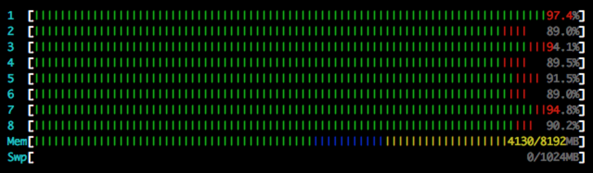

# Quick Intro to Scala 

## Why would I use Scala?

The elegance and expressivity of Python, with the speed, type-safety and concurrency of Java.

Imagine Java with less typing and better functional programming support.

* Runs on JVM
  * **Easy multi-core shared-memory concurrency** (not the case for CPython, Julia, etc., etc.)
  * Interop with Java means tons of libraries for everything.
  Can use Scala's interactive REPL to poke around Java libraries
  * Type-safe.
  This eliminates entire classes of bugs.
  It requires some extra effort, but type inference mitigates that.
  * Super stable, portable, easy for other researchers to run
  * Fast-ish. Faster than interpreted languages. 
  * Transparent easy unicode text support. Strings are stored as UTF-16. Done.
    (Python made weird unicode choices that they're struggling to undo. R and Matlab don't care about text.)
* Also compiles to JavaScript (new!). Try [Scala.js in the browser](http://www.scala-js-fiddle.com/).
* Once you're familiar with it, pure functional code is easier to write bug-free code with.
Mutable state and side effects make everything hard.


## Why wouldn't I use Scala?

* There is a learning curve
  * The syntax is complicated, too many features
  * Trying to do generic types and collections "right" is hard.
  * Functional programming itself has a learning curve.
    If you're not familiar with functional programming, reading other people's functional code is hard.
  * Fewer researchers can extend your code.
* Slow compilation. This has gotten better, esp. with incremental compilation, to the point that it doesn't bother me.
* You can't run your code if it has compile errors.
  This is a good thing, but compilation errors involving complicated types are... frustrating.
* Slower than C (which a lot of Python extensions are written in). I think(?) GPU programming on the JVM involves more data copying than in C. 
* Some Scala libraries overuse symbolic method names, makes it hard to read. 
* Wide range of coding styles possible, means you might disagree with your colleague's style.
* Your favorite library/tool doesn't have Java bindings?
* If you're really into functional programming and don't need JVM libraries, there are better functional languages.
* Java 8 stole some stuff from Scala, so Java isn't quite as bad as it used to be.
Languages get better all the time, so all this advice gets out-of-date fast.


## Code Examples

### Hello World                

Static methods are put in `objects`:

```tut
object HelloWorld {
  def main(args: Array[String]) {
    println("Hello, world!")
  }
}
```
You can compile and run this just like a Java class.

### Variables

`vars` can be reassigned:
```tut
var a = "a"
a = "b"
```

but only with the correct type:
```tut:fail
a = 2
```

`vals` are single-assignment only.
Use them whenever possible (always?):
```tut
val c = "c"
```
```tut:fail
c = "d"
```

`lazy vals` are calculated only if they are needed, and then remembered for future use:
```tut
lazy val e = {
  println("calculating")
  2
}
println(e)  // needs to run the code block the first time you access it.
println(e)  // already has the result cached.
```
**Code blocks** (one or more statements inside curly braces) return the value of the last expression inside them.
No `return` keyword needed (like Ruby).

Scoping rules are sane (unlike Python). 

### Methods/functions

**Methods** are attached to classes or objects (except in the REPL), and have access to internals of the class instance.
Use the `def` keyword to define methods.
Types of the arguments of a method must be specified.
Return types can be inferred, but you *should* specify them for readability.
Curly braces are optional for single-expression methods.

```tut
def f(x: String): Int = x.length
```

Methods can have type parameters. They can also have multiple (**curried**) parameter groups:

```tut
// `A` and `B` are type parameters.
def constant[A, B](a: A)(b: B): A = a  // ignores its second argument
```
Type parameters can be given explicitly at call time:
```tut
constant[Double, Boolean](3.2)(true)
```
but can usually be inferred:
```tut
constant(3.2)(true)
```


#### Functions

**Functions** can't have type parameters, but they can be stored in variables.
```tut
val strLen = (x: String) => x.length
```

**Higher-order** methods/functions like `map` accept methods/functions as arguments.
```tut
val xs = List("asdf", "as", "asd", "a")
xs.map(strLen)
xs.map(constant(HelloWorld))
```

You don't have to give a function a name, nor specify argument types if they can be inferred:
```tut
xs.map(x => x.length) 
```

or even more terser:
```tut
xs.map(_.length)  // the underscore is a placeholder function argument
```


### For-comprehensions


```tut

for (i <- Array(2, 3, 4)) yield { i * i }  // same as `Array(2, 3, 4).map(i => i * i)`
```

### Parallelism

This single-threaded code:

```tut
for (
    i <- (0 until 20)
) yield {
    println(i)
    i * 2
}
```

turns into multi-threaded code with the addition of the four magical characters `.par`:

```tut
for (
    i <- (0 until 20).par
) yield {
    println(i)
    i * 2
}
```

Boom.



The order of side-effects (print statements) is not guaranteed, but the order of the returned collection is guaranteed.


### Data modeling

You can create data structures with many fewer lines of code than Java.

**Pattern matching** is a powerful way to organize your code.

To illustrate, here's an example of how to do automatic differentiation
for a simple language where you can only add constants and variables
(adapted from http://www.scala-lang.org/docu/files/ScalaTutorial.pdf):
 
```tut:silent
/** `trait` is like a Java `interface`.
  * `sealed` means it can only be extended in the same file.
  * `sealed traits` are often used like an `enum` would be in Java.
  */
sealed trait Expression
/** A `case class` is a fast way to define a "value" class: a class that
  * holds immutable data.
  * Two instances of the same `case class` are equal and have the same hashCode
  * if all their fields are equal.
  */
case class Sum(left: Expression, right: Expression) extends Expression
case class Var(name: String) extends Expression
case class Const(value: Int) extends Expression
// So an `Expression` is either a `Sum`, a `Var`, or a `Const`.
// There are no other possible `Expressions`.

object Expression {
  type Environment = Var => Int  // a type alias
  
  // since `Expression` is sealed, the compiler knows that this match is exhaustive.
  // It warns you if you forget to handle a case.
  def eval(t: Expression, env: Environment): Int = t match {
    // case classes can be destructured (match and bind variables at the same time)
    case Sum(l, r) => eval(l, env) + eval(r, env)
    case Const(i) => i
    case v: Var => env(v)  // or you can match on type
  }

  def derivative(t: Expression, v: Var): Expression = t match {
    case Sum(l, r) => Sum(derivative(l, v), derivative(r, v))
    // you can use conditional guards in your pattern matches
    case Var(name) if name == v.name => Const(1)
    // the default case. `_` matches anything
    // (one of the gazillion different uses of underscore in Scala).
    case _ => Const(0)
  }
}
```

```tut
object AutoDiffApp {

  def main(args: Array[String]) {
    import Expression._  // you can import into any scope

    val x = Var("x")
    val y = Var("y")
    val exp = Sum(Sum(x, x), Sum(Const(7), y))
    // `Map[A, B]` inherits from `A => B` so we can use it as an `Environment`. 
    val env = Map(
      x -> 5,
      y -> 7
    )
    println("Expression: " + exp)
    println("Evaluation with x=5, y=7: " + eval(exp, env))
    println("Derivative relative to x:\n " + derivative(exp, x))
    println("Derivative relative to y:\n " + derivative(exp, y))
  }
}

AutoDiffApp.main(Array())
```

### Implicit parameters

```tut
def greaterThan[B](x: B, y: B)(implicit ord: Ordering[B]): Boolean = ord.gt(x, y) 
```
You can omit implicit parameters if there is an implicit instance in scope:
```tut
greaterThan(2, 3)  // `Ordering.Int` is implicitly imported in every file / REPL session, so gets used here
```
Or you can pass them explicitly:
```tut
greaterThan(2, 3)(Ordering.Int.reverse)
```

### Implicit conversions

Scala provides a nice way to add methods to (a.k.a. **enrich**) existing classes,
even when you don't have access to the source code of those classes.

```tut
implicit class Powerable(val self: Double) {
  def toThePower(power: Double): Double = math.pow(self, power)
}

2 toThePower 5  // gets expanded to `new Powerable(2).toThePower(5)` at compile time if `Powerable` has been imported
```

We can essentially add new operators to the language.
E.g. F# people like the `|>` operator which allows you to "pipe" data through a series of functions.
Scala doesn't have it, but we can add it:
```tut
implicit class Pipeable[A](val self: A) {
  def |>[B](f: A => B): B = f(self)
}
```
used like so:
```tut
def normalizeNums(s: String): String = s.replaceAll("[0-9]", "#")

def normalizeParens(s: String): String = s.replaceAll("\\(", " -LRB- ").replaceAll("\\)", " -RRB- ")

"(born in 1982)" |> normalizeNums |> normalizeParens |> (_.trim.split(" +"))
```
which makes the flow of data clearer than in the normal "inside-out" reading order of function application:
```tut
normalizeParens(normalizeNums("(born in 1982)")).trim.split(" +")
```

## Random advice

* Use an IDE (IntelliJ IDEA, Eclipse + Scala plugin, Scala IDE, ...) 
* Use [sbt](http://www.scala-sbt.org/) (least bad build tool for Scala at the moment).
* [Breeze](https://github.com/scalanlp/breeze) is a great NLP/ML library
* [ScalaCheck](https://www.scalacheck.org/) is a mind-blowingly cool way to test your code.
